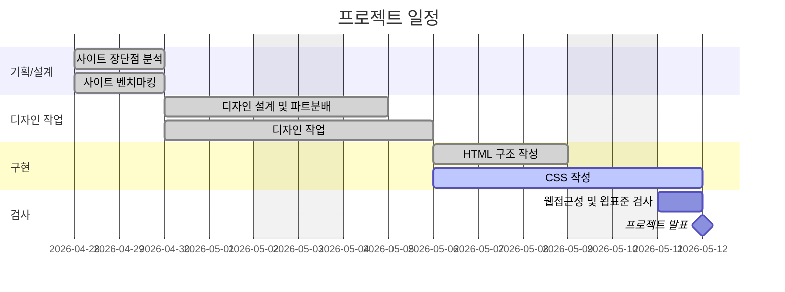

# (1차 프로젝트)

- 과정명: 오르미 프론트엔드 개발자 부트캠프
- 기간: 2026/04/30 ~ 2026/05/12

## 빠른 링크

## 1. 프로젝트 개요

### 1.1 목표

- [이스트소프트 교육 모집 웹페이지](https://estbootcamp.co.kr/) 개선

### 1.2 팀원 및 역할

- 첫 프로젝트는 주요 담당 역할 없이 작업을 나눠서 맡음

|  이름  | 역할 |                 Figma 디자인 담당 파트                 |      HTML 및 CSS 작성 담당 파트       |          기타 담당           | GitHub                                                     | 이메일                                             |
| :----: | :--: | :----------------------------------------------------: | :-----------------------------------: | :--------------------------: | ---------------------------------------------------------- | -------------------------------------------------- |
| 유태구 | 팀장 | 헤더, 히어로, 수강생 취업 현황, 강의 만족도, FAQ, 푸터 |    헤더, 히어로, 수강생 취업 현황     | 프로젝트 발표   Git 관리 | [@rozer4heros](https://github.com/rozer4heros)             | [rozer4heros@gmail.com](rozer4heros@gmail.com)     |
| 박소영 | 팀원 |         수강생 혜택, 강좌 목록, 신청 데드라인          | 상단 슬로건, 수강생 혜택, 홍보용 통계 |         회의록 작성          | [@s0-p](https://github.com/s0-p)                           | [b00v0429@gmail.com](b00v0429@gmail.com)           |
| 조승아 | 팀원 |          대상 고객 안내, 상단 및 하단 슬로건           | 사이드 nav, 강좌 목록, 대상 고객 안내 |                              | [@eodrn7021-cell](https://github.com/eodrn7021-cell)       | [eodrn7021@gmail.com](eodrn7021@gmail.com)         |
| 박채원 | 팀원 |                 수강 요건, 사이드 nav                  |   수강 후기, 수강 요건, 하단 슬로건   |                              | [@chaewon5205](https://github.com/chaewon5205)             | [parkjihae9262@gmail.com](parkjihae9262@gmail.com) |
| 권유진 | 팀원 |                 수강 후기, EST 콘텐츠                  | EST 콘텐츠, FAQ, 신청 데드라인, 푸터  |        대본 초안 작성        | [@rwonyujin03-debug](https://github.com/rwonyujin03-debug) | [rwonyujin03@gmail.com](rwonyujin03@gmail.com)     |

### 1.3 마일스톤

#### 1일차 (04-28)

- [ ] 사이트 장단점 개별 분석
- [ ] 벤치마킹 대상 사이트 수집

#### 2일차 (04-29)

- [ ] 분석 내용 및 벤치마킹 합치
- [ ] 프로젝트 기획안 슬라이드 및 대본 1차 작성
  - [ ] 현황 분석
  - [ ] 벤치마킹
  - [ ] 리뉴얼 방향 도출

#### 3일차 (04-30)

- [ ] 프로젝트 1차 발표
- [ ] 스토리보드 제작

#### 4일차 (05-01)

- [ ] 사이트 색상 스타일 지정
- [ ] Figma 디자인 담당 파트 분배
- [ ] Figma 기본 골격 제작 (Layout Guide)

#### 5일차 (05-04)

- [ ] Figma 메인 디자인 완성 (PC-First)

#### 6일차 (05-05)

- [ ] Figma 반응형(모바일) 디자인 완성
- [ ] 프로젝트 기획안 슬라이드 2차 작성
  - [ ] 디자인 시안

#### 7일차 (05-06)

- [ ] Figma 디자인 개편
- [ ] GitHub 저장소 생성 및 로컬 환경 연결
- [ ] 시맨틱 태그를 사용하여 전체 HTML 골격 작성
- [ ] HTML 및 CSS 작성 담당 파트 분배

#### 8일차 (05-07)

- [ ] 필요한 이미지, 아이콘, 폰트 등의 자산 추출/준비
- [ ] Figma 기준 색상, 폰트, 간격 적용
- [ ] 공통 스타일(리셋·폰트·변수) 적용

#### 9일차 (05-08)

- [ ] 공통요소 스타일 적용
- [ ] 헤더·메인·푸터 등 주요 파트 스타일 완성

#### 10일차 (05-11)

- [ ] 버튼·폼·이미지 등 세부 요소 스타일링
- [ ] Figma와 디자인 비교·오차 수정
- [ ] 웹표준 & 웹접근성 검사 및 수정
- [ ] ReadMe.md 작성
- [ ] GitHub Pages 배포 설정 및 URL 공유

#### 11일차 (05-12)

- [ ] 프로젝트 기획안 슬라이드 및 대본 최종 작성
- [ ] 프로젝트 최종 발표

## 2. 개발 환경 및 배포

### 2.1 개발 스택

Frontend

- Structure: HTML
- Styling: CSS

Tools

- Version Control: Git & GitHub
- Code Editor : Visual Studio Code
- Design: Figma

### 2.2 URL

- [이스트소프트 | 부트캠프 모집 홈페이지](https://s0-p.github.io/est_fe_13_1st_project/)

## 3. 프로젝트 구조

> est_fe_13_1st_project/  
> ├─ .vscode/  
> ├─ css/  
> │ ├─ common.css  
> │ ├─ index.css  
> │ ├─ flex-utility.css # Flex 정렬·레이아웃 라이브러리  
> │ ├─ normalize.css  
> │ └─ reset.css  
> ├─ image/  
> ├─ common.html # 컴포넌트 라이브러리  
> ├─ index.html # 메인 페이지  
> └─ README.md '''

## 4. 향후 개선 사항

- 동적 요소 미구현
- 공통 컴포넌트(common.html) 사용 부족
  - 별도의 내부 컨테이너를 과도하게 사용해 유지·보수가 어려움

## 5. 제작 후기

- 유태구: Git 관리를 하면서 애매하거나 잘 모르는 부분은 AI를 활용해 클래스명 작명법, 커밋 메시지 작성법, 어려운 문제 해결 방법을 배우고 나아가 팀에 대한 책임감도 기르는 시간을 가질 수 있었다.
- 박소영: 단순한 페이지 제작을 넘어 기획부터 배포까지의 전체 사이클을 경험하며 시야를 넓힐 수 있었다. 특히 팀원들과 Git으로 호흡을 맞추며 겪은 시행착오들은 혼자 공부할 때는 알 수 없었던 값진 경험이었다.
  팀원 간의 적극적인 소통 덕분에 프로젝트를 끝까지 성공적으로 완주할 수 있었지만, 기능 구현에 집중하다 보니 정작 코드를 다듬고 검증할 시간이 부족했던 점이 아쉽다. '돌아가는 코드'를 넘어 '지속 가능한 코드'를 만들기 위한 리팩토링의 중요성을 다시 한번 절감한 프로젝트였다.
- 조승아: 처음 진행한 팀 프로젝트여서 미흡했던 부분이 많았지만 Figma를 활용한 디자인 작업과 Git 협업 과정을 직접 경험하며 실제 프로젝트 제작 흐름을 이해할 수 있었다. 어려운 부분이 많았지만 팀원들의 도움을 많이 받아 프로젝트를 완성할 수 있어서 좋았다.
- 권유진: 웹 페이지 제작의 흐름에 대해 깊이 있게 이해할 수 있는 과정이었다. 특히 팀원들과 피드백 과정을 통해 개인의 역량을 넘어 동기분들과 함께 성장하고 협업결과물을 도출해낼 수 있었다.
- 박채원: 피그마와 코드를 활용해 사이트를 직접 구성하고 리뉴얼하는 경험을 했다. 익숙하지 않은 부분은 AI를 참고하며 맡은 역할을 끝까지 책임감 있게 수행했고, 해결이 어려운 문제는 팀원들과 적극적으로 소통하며 하나씩 풀어나갔다. 특히 팀원분들의 따뜻한 도움과 배려 덕분에 프로젝트를 끝까지 잘 마무리할 수 있었으며, 협업의 중요성을 다시 한번 느낄 수 있었다.

## 6. 기획/디자인 문서

- [기획 슬라이드(피그마 슬라이드)](https://www.figma.com/slides/NsGzmNRyeujiGmuqMgXBxt)
- [디자인 시안(피그마)](https://www.figma.com/design/bUzmsPXP15RsPYMmtjsPpp/%EB%94%94%EC%9E%90%EC%9D%B8-%EC%8B%9C%EC%95%88?node-id=0-1&t=aNipptFfc3rsLdrL-1)
